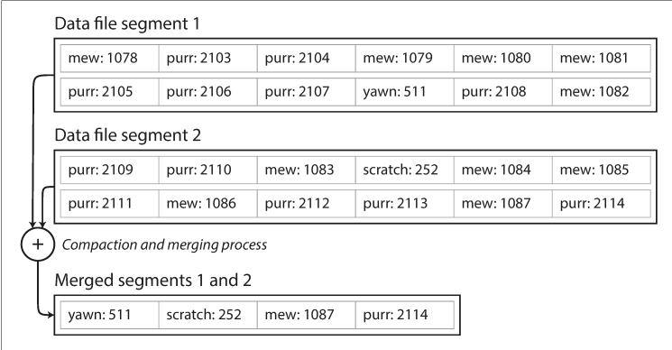

# Chapter 3: Storage and Retrieval
- We discussed how we as an application developers choose how to model, store and retrieve data, now we will look into how the storage engines internally manage storage and retrieval
## Log Oriented Storage Engines Vs Page Oriented Storage Engineers like B Trees
- key value pair is the simplest database, it has great write speeds, O (1), because it appends to the file, on the other hand, it has poor read speeds for large databases because it has to search the entire database linearly hence leading to an O (N) time complexity.
This appending approach is used for logging in many databases.
- For increased read operations, we can maintain certain metadata about the data like an index which is a quicker way to locate a node. However, having an index slows down write operations because we have to update the index as well when a new value is added. 
Common data storage systems give the option to add an index on fields, but they do not do it by default since it can slow down read operations, we developers have to trade-off between read and write rates
### Hash Indexes
- Hash indexes are similar to Hashmaps in programming, they use key value pairs to save the storage offset of information, for example, we have a cat picture and we want to save the clicks on that cat picture so we use the picture url as key and save offsets to its value on disk so we only need one disk seek to get it's click value and update it accordingly.
- Hash indexes are in memory index, Bitcask is a tool that uses Hash indexes, Bitcask is useful for the cat url use case, a case where there are a lot of updates and writes to a node.
- Now the hash index table is appended to a file, so we need to avoid running out of disk space, one solution is to set a limit for file size, and break the file into segments when it reaches that segment and start appending to that file. Then we apply compaction to join the segments and minimize them, saving only the latest values for the keys.

## Common issues that we have to look out for
### File format
a binary format is recommended for a log instead of csv. We don't need to handle escape characters in that case.
### Deleting records
If we want to delete a key, we must append a tombstone marker for the key, so that when compaction occurs, we can discard the tombstone record.
### Crash recovery
Saving a copy of the hashmap snapshot is a good approach to quickly setup the hashmap again, this approach used by Bitcask, we can also read the segment file of each segmented read the latest offset value to reconstruct the hashmaps for each segment but that would be slow.
### Partially written records
The database may crash anytime, so we can use checksums to delete partially written records.
### Concurrency control
In append only files, having a single write thread at a time is enough, and we can have multiple read threads.
## Advantages of append only hash tables indexes over rewriting particular sections
1. Append only is faster than sequential write operations on hard drive and even on SSD's to some extent
2. Concurrency and crash reporting is easy in append only structures
## Disadvantages
1. Hash tables have to fit in memory, if you have a large number of keys, you have to use disk storage which is slow.
2. Range queries in Hashmaps are not efficient. for example, key 100 to 200 have to be searched individually.

**Let's look at an index that does not have such limitations**
## SSTables and LSM-Trees
Sorted string tables are similar to hash indexes with the difference being that
1. the keys are sorted.
2. Each key only appears once within each merged segment file (the compaction process
already ensures that).
### Advantages
1. Merging segments of SSTables is simple and efficient because we can use merge sort technique to merge them side by side since they are sorted, if a key exists in all three segments we will use the one in the latest segment since segments are created overtime.
2. You no longer need to keep all of the keys of the hashmap in memory, since this is sorted you can keep sparse keys in memory and their offset value, as an example, we get a query for 4th
value, now we have 1 and 6 in our memory as keys, and we know that 4 is between them so we can just navigate to 1 in the disk and search from there.
3. We can compress key value pairs into blocks before writing to disk since we might be making a lot of range queries due to the sparse memory index. This will decrease I/O bandwidth as well
4. If the keys and values have a fixed length, we can use binary search and do not need the sparse memory index at all.

**We can sort the keys in memory using AVL trees and Red Black trees**

### In summary our storage engine will work as follows
1. When a write comes in, store it in the in memory tree/ memtable.
2. If the memtable reaches a particular threshold, store that data into disk.
3. To serve a read request, search the key in the memtable, if not found, use the memtable(sparse index) to find it in disk.
4. From time to time, run a merging and compaction process in the background to
combine segment files and to discard overwritten or deleted values.
5. One disadvantage is that in case of crash, the memtable is lost. Maintain an unsorted append only log in disk for each write to the memtable,  in case of a crash, we can restore the in memory memtable and when we write the memtabe to disk, we can discard the last one.
6. SSTables like structures are used in LevelDV, RocksDb, Cassandra, and HBase.
## SSTables based storage engineers are normally called LSM storage engines
Storage engines that are based on this principle of merging and compacting sorted files are often called LSM (Log-Structured Merge-Tree) storage engines.
Lucene, an indexing engine for full-text search used by Elasticsearch and Solr, uses a similar method for storing its term dictionary.
We can use bloom filters on the set to check whether a value exists or not so we do not need to traverse the entire tree and disk to find a non-existent value.
## B trees
B trees use fixed block pages to store keys and references, we use range queries to search a value in fixed blocks, B trees are balanced trees. To search a key, we identify the range
it is in, then we find that reference and go to that block to search for that key. We can overwrite the key without changing the reference. This is in stark contrast to LSM storage
where we do not overwrite but append data.
We use Write ahead log(WAL) to append B tree operations so we can restore B tree state in case of a crash.
Some B tress use copy on write method for optimization.
## B trees vs LSM trees
Use LSM trees if for fast writes but low reads.
Use B trees for faster reads but lower writes.

## LSM trees advantages over B trees
1.LSM trees are better in the sense that they have fewer writes and also result in less disk space taken due to compaction while B trees have fragmentation.
2.LSM sometimes have lower write amplification due to continuous compaction.
## LSM trees disadvantages
1. the compaction process can effect performance and write bandwidth with high write throughput tasks.

In the end choose the type of storage engine wisely by testing your workload empirically on both.
## Other indexing structures
1. Multi column index
Often used to index mult dimensional information like location coordinates or lastname, first for efficient joins. We can make this by story the single value key as a combo of the mult values
as such, key: "longitude:latitude", this is called a concatenated index and it is the most common, for this example it can query last names, last names and first names but not first names.
2. Full-text search and fuzzy indexes
Used for searching similar, misspelled or fuzzy words, example, Lucene. Lucene is able to search text for words within a certain edit distance (an edit distance of 1 means that one letter has been
added, removed, or replaced)
3. Keeping everything in memory
Considering RAM is becoming cheaper and larger, a famous approach is to use fully in memory database such as Memcached or Redis.
A point to consider is that the performance enhancement of in memory dbs is not because of RAM just being faster, even the hard drive caches results so we do not have to perform an I/O every time for the same data. It's because in memory dbs don't have to deal with the overhead of constructing data according to the structure of the hard disk.
## OLTP vs OLAP
- OLTP are used for transaction processing and when we want to make a transaction highly available with low latency.
- OLAP is used for data analytics when we want to access multiple rows from a few columns. We introduce redundancy to decrease query time.
## Data warehouse
- Organizations keep a separate data store to store data for analytics.
- It is usually read only and can be queried without effecting the OLTP database
- We get data inside the data warehouse using Extract, transform, load (ETL) process
## Data warehouses have two famous schemas
1. **Star schema** has a fact table and multiple dimension tables
2. **Snowflake schema** A variant of a star schema where dimensions are further broken down into sub dimensions. It is more normalized but complex
## Column oriented storage
- A data warehouse may have 100s of columns out of which we only need to query 4-5 at a time. In OLTP systems when we load columns
from a table, we load the entire row which is extra overhead. In order to avoid that we can divide the data by columns, each columns data is kept separately.
- In order for this to work order of related columns should be same.
## Column compression
Keeping separate columns are great for compression, especially if they are distinct. Bitmap index can be used for this purpose.
## Memory bandwidth
Single column fields rows are also good for I/O bandwidth
## Writes to sorted single column compressed rows
LSM trees are great for writing to single column compressed rows because they are already sorted. An in place write index like B tree is not ideal for this.
## Materialized view and data cubes
For repeated aggregated queries it does not make sense to query the raw data gain, we can store them in materialized views and Data cubes is an example for them.