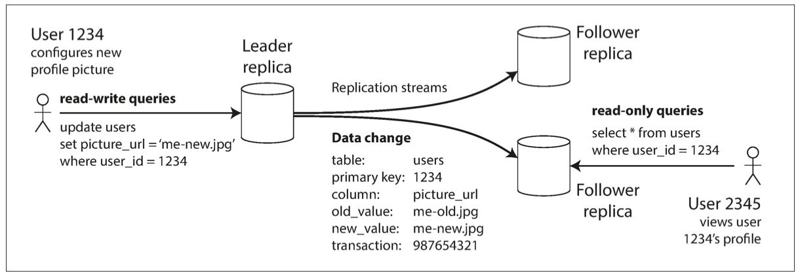
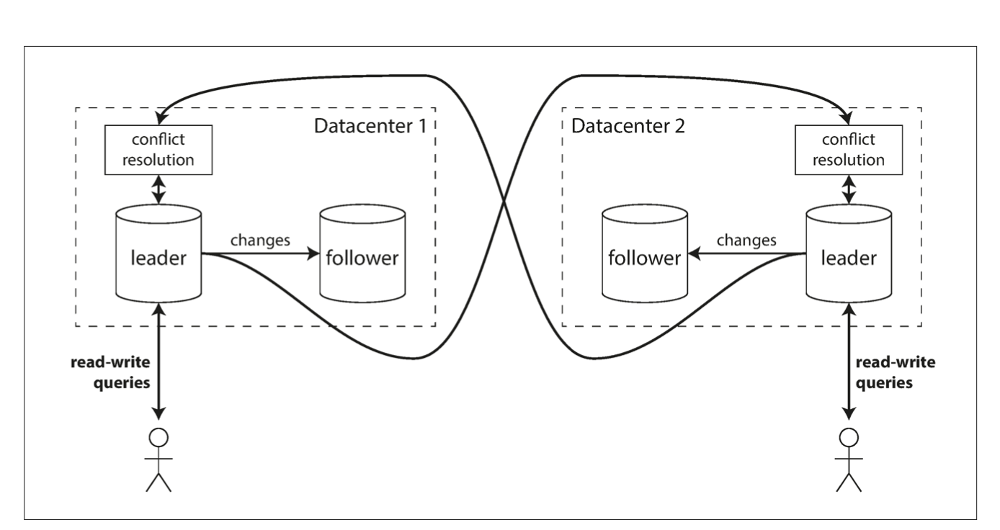

# Chapter 5: Replication

## Replication is used for
1. High latency (putting data in close geolocations to user)
2. High availability
3. High write throughput.

Replication is all about dealing with changes

## Replication in database has three types
-	Single Leader
-	Multiple Leaders
-	Leaderless

## Leader and follower
Data is written to reader; followers replicate it from logs

## Followers copy logs either synchronously or asynchronously
Synchronise is slower but accurate, in async, leader doesn’t wait for followers to give the confirm status.
The advantage of synchronous replication is that the follower is guaranteed to have an up-to-date copy of the data that is consistent with the leader.
The disadvantage is that if the synchronous follower doesn’t respond (because it has crashed,
or there is a network fault, or for any other reason), the write cannot be processed.
The leader must block all writes and wait until the synchronous replica is available
again.
For that reason, it is impractical for all followers to be synchronous: any one node
outage would cause the whole system to grind to a halt. In practice, if you enable synchronous
replication on a database, it usually means that one of the followers is synchronous,
and the others are asynchronous. 

## Setting up new followers
1. Take leader snapshot.
2. Copy to the follower, ideally without blocking.
3. Follower asks for all changes in leader ever since it took snapshot using a log sequence.
4. Follower copies and has caught up, it can then process data normally

## Handling outages
### For follower
Catch up recovery, same principle as setting up a new follower, check the last copied log sequence and start from there.
### For Leader(Failover)
1. Determining that the leader has failed.
2. Choosing a new leader. The best candidate for
leadership is usually the replica with the most up-to-date data changes from the old leader (to minimize any data loss).
3. Reconfiguring the system to use the new leader.

## Implementation of replication logs
1. Statement based
2. Write ahead log(WAL) shipping
3. Logical (row-based) log replication
4. Trigger-based replication

## Replication lag
It is due to async followers, we have eventual consistency.

## Problems with replication lag due to async followers

### Reading your own writes
Some users edit data and want to see the latest information right after replication lag might cause an issue in this case, especially for async followers.

### 1.1 Possible solutions
1. Use Leader for read after write consistency
2. In case of a software that primarily has a lot of writes use leader for a fixed duration after last update and then shift to followers.
3. Show followers that has the last update after our most recent write.

### 1.2. Monotonic reads
User refreshing the page may see disappearing data, for example after refresh 1 a comment might be visible but after refresh 2 a follower with a larger replication lag may be routed thus it might
not have the data. Monotonic consistency just needs us to route the same user to the
same follower each time, if the follower fails, only then should we route the user to another follower.

### 1.3. Consistency prefix reads:
if a sequence of writes happens in a certain order, then anyone reading those writes will see them appear in the same order.

## Multi leader data centres
Having a leader in each data centre.

## Differences to single leader approach
1. Performance: Better perceived performance in multi leader data centres due to closer locations to your and less data centre lag.
2. Tolerance of datacentre outages: In mult-leader centres, if one datacentre goes down, another just takes its place.
3. Tolerance of network problems: single leader integration is more  prone to network issues then multi leader data centres.

Multi leader data centres are very dangerous.
## Design Principles
- Emphasis
- Hierarchy
- Balance & Unity
- Proximity design principle

## Multi-Leader Replication Topologies
1. **Circular topology** MySQL by default supports only a circular topology, in which each node receives writes from one node and forwards those writes (plus any writes of its own) to one other node.
2. **Star topology** one designated root node forwards writes to all of the other nodes. The star topology can be generalized to a tree.
3. **All to all topology** The most general topology is all-to-all, in which every leader sends its writes to every other leader.

## Note
In circular and star topologies, a write may need to pass through several nodes before it reaches all replicas. Therefore, nodes need to forward data changes they receive from other nodes. To prevent infinite replication loops, each node is given a unique identifier, and in the replication log, each write is tagged with the identifiers of all the
nodes it has passed through.

## Leaderless replication
Dynamo system Riak, Cassandra, and Voldemort are open source datastores with leaderless replication models inspired by DynamoDB.

## Quorums for reading and writing
More generally, if there are n replicas, every write must be confirmed by w nodes to be considered successful, and we must query at least r nodes for each read. (In our example, n = 3, w = 2, r = 2.) As long as w + r > n, we expect to get an up-to-date value when reading, because at least one of the r nodes we’re reading from must be up to date. Reads and writes that obey these r and w values are called quorum reads
and writes. You can think of r and w as the minimum number of votes required for the read or write to be valid.

