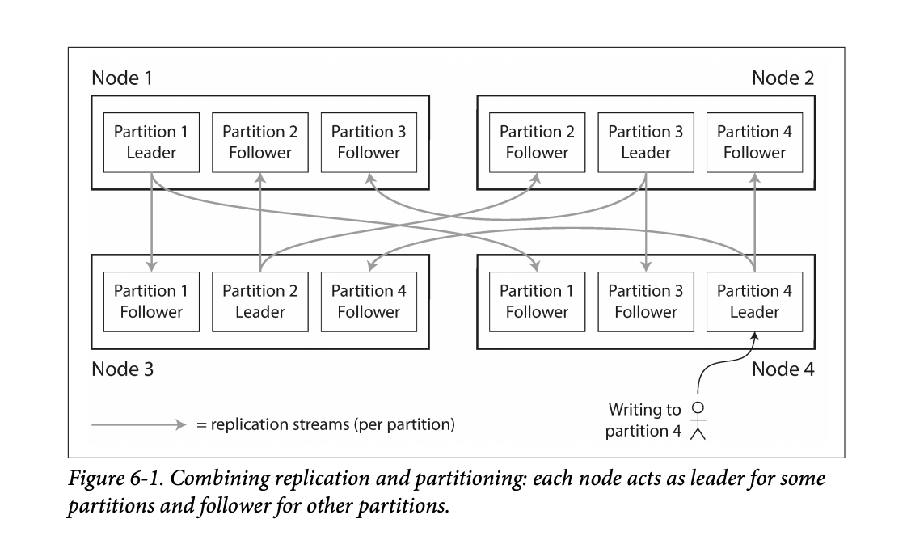

# Chapter 6 - Partitioning
Partitioning or sharding is the process of breaking data down into partitions. Each row or document belongs to a single partition.

## Note
What we call a partition here is called a shard in MongoDB, Elasticsearch, and SolrCloud; it’s known as a region in HBase, a tablet in Bigtable, a vnode in Cassandra and Riak, and a vBucket in Couchbase. However, partitioning is the most established term, so we’ll stick with that.

## Partition and replication
Partitioning and replication go hand in hand, a partition is stored in multiple nodes. The choice of replication mode is independent of partitioning scheme.

**In Figure 6-1,  each node acts as leader for some partitions and follower for other partitions.**

## Partitioning of Key-Value Data
The goal is to spread the data equally among partitions. If the partitioning is unfair, so that some partitions have more data or queries than
others, we call it skewed. This results in some partitions becoming hotspots. We can mitigate hotspots somewhat by partitioning randomly but that decreases our querying ability because we have to search all nodes for row.

## Partitioning by Key Range
Assign a continuous range of keys to a partition.
Not necessarily evenly spaced.
If we know key boundaries we directly go to the partition that has that row and even the node if we know it.
Within each partition, we can keep keys in sorted order.
This makes range scans easy.

## Example
A network of scanners that use timestamps as keys, we can use timestamp to add and fetch data and to partition it.
But this can cause a timestamp to become a hotspot. We can concate the server id or MAC address to the timestamp to balance the writes.
This will cause us to search for a range in all nodes.

## Partitioning by Hash of Key
To avoid hotspots and skewed partitions we can sue hash keys.
A good hash function takes skewed data and makes it uniformly distributed, even if the keys are similar.
Cassandra and MongoDB use MD5 Hash, and Voldemort uses the Fowler–Noll–Vo function.
Make sure the hash gives the same vale for same key.
Assign a range of hashes to each partition instead of range of keys.

## Cons
We lose the ability to make range queries. We can still use range queries per partition. Cassandra does this.

## Partitioning and Secondary Indexes

### a. Partitioning Secondary Indexes by Document
Let's say we have cars with ids, colours and make, let's say we want to make colour and make secondary indexes. each partition can maintainbtheir own secondary index for their own ids, for example:

### Partition 0
**primary key index**
199: {color: 'red', make:'2006'}
200: {color: 'red', make:'2008'}
201: {color: 'green', make:'2008'}

**secondary index**
color:red: [199, 200]
make: 2008: [200, 201]

### Partition 1
-----------------	
-----------------

## b.Partitioning Secondary Indexes by Term
1. Rather than each partition having its own secondary index (a local index), we can
 construct a global index that covers data in all partitions.
2. Distribute the secondary index in each partition based on key ranges.

### Pros
The advantage of a global (term-partitioned) index over a document-partitioned
index is that it can make reads more efficient: rather than doing scatter/gather over
all partitions, a client only needs to make a request to the partition containing the
term that it wants.

### Cons
 Writes may take more time since each secondary has to be written to its own partition.

## Rebalancing partitions
### What not to do
 XmodN, If we add another node, a partition that is in node 2 might have to be shifted to node 4.

### Fixed number of partitions
Instead have many more nodes then partitions, in this approach, we can easily add another node and that node can just steal partitions from another node a database running
on a cluster of 10 nodes may be split into 1,000 partitions from the outset so that
approximately 100 partitions are assigned to each node.

### Dynamic partitions
DB adds nodes dynamically, one caveat is that initially there is a single partition in the first node only and the rest of the nodes
sit idle, this is because we have no prior information about partitioning range so partitioning is done overtime with size of dataset.

## Request Routing
We have several nodes that might be rebalanced. 
This is a common problem called service discovery faced by any network oriented systems.

**Three methods**
1. Use round robin to map client to map web server to any node and if that node is not the correct node it can redirect to the correct node.
2. Send all requests from clients to a routing tier first, which determines the node
that should handle each request and forwards it accordingly. routing tier
does not itself handle any requests; it only acts as a partition-aware load balancer.
3. Requeire clients be aware of nodes and have no intermediary.

## Parallel Query Execution
Massively parallel processing (MPP) relational database products are products that make queries with several joins and filters and not
like the simple queries that we studied.

The MPP query optimizer breaks this complex query into a number
of execution stages and partitions, many of which can be executed in parallel on
different nodes of the database cluster. Queries that involve scanning over large parts
of the dataset particularly benefit from such parallel execution.

